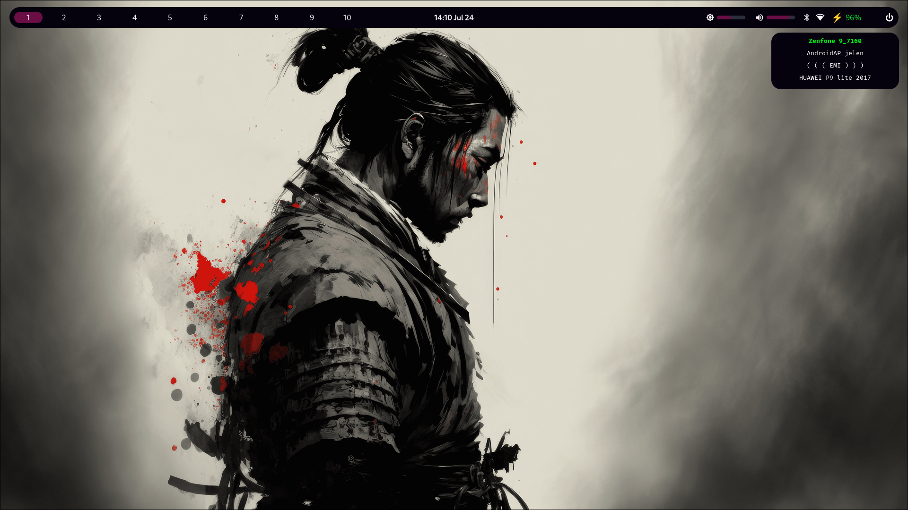
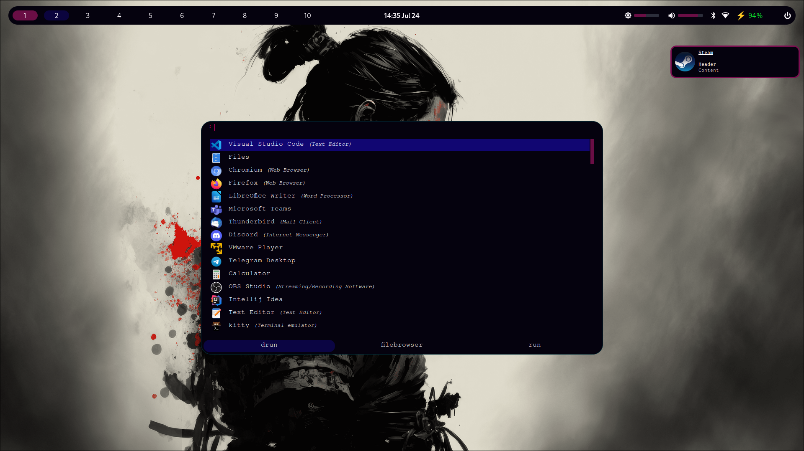
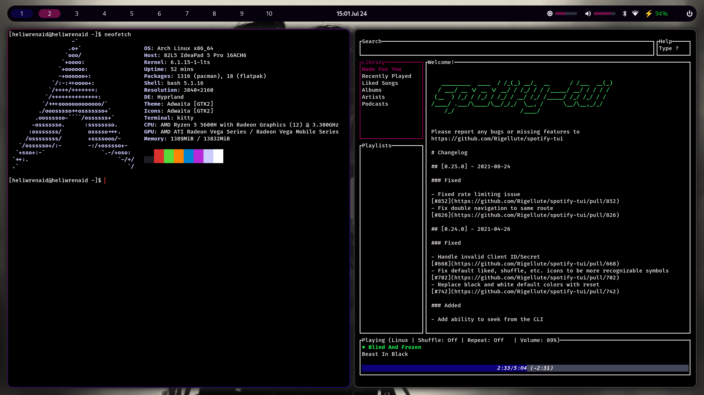

## Specification
- Window manager: hyprland
- Terminal: kitty
- Shell: bash
- Panel: eww
- Launcher: rofi
- Notification daemon: dunst
- Wallpaper daemon: swww
- Screenlock: swaylock

## Screenshots





https://github.com/Heliwrenaid/linux-themes/assets/69712720/efda88dd-82ed-4a7a-80fe-ca502650738c


## Requirements

In order to run configuration properly install following packages:

### Arch Linux

Hyprland:

```
$ sudo pacman -S hyprland xdg-desktop-portal-hyprland
```
Other packages:

```sh
$ sudo pacman -S stow dunst kitty grim slurp swayidle swaylock bluez bluez-utils python socat jq alsa-utils pipewire wireplumber polkit-kde-agent networkmanager ttf-nerd-fonts-symbols-common ttf-fira-code
```

```sh
$ yay -S rofi-lbonn-wayland-git
```

And compile needed stuff from source: [eww (wayland)](https://github.com/elkowar/eww), [swww](https://github.com/Horus645/swww)

### NixOS

Installation steps will be added in the future.

### Other

Hyprland is [unofficialy supported](https://wiki.hyprland.org/Getting-Started/Installation/#packages) in other distros. After configuring hyprland you need to install equivalent packages (but names can vary).

## User specific configuration
Provided configuration works with default monitor. You can configure multiple monitors following official [wiki](https://wiki.hyprland.org/Configuring/Monitors/).

To enable automatic wallpaper changing uncomment below line in [hyprland.conf](./hypr/hyprland.conf) and replace `<PATH TO DIR>` with directory containing ONLY images:

```
exec-once=~/.config/scripts/swww_randomize.sh <PATH TO DIR> &> /dev/null &
```

If you want to change wallpaper using `SUPER + I` adjust also `<PATH TO DIR>` in the following line in [hyprland.conf](./hypr/hyprland.conf):

```
bind = $mainMod, I, exec, ~/.config/scripts/swww_randomize.sh <PATH TO DIR> change &> /dev/null
```


## Extra keybindings

In addition to the Hyprland's default keybindings, the following have been added:

- `SUPER + A` - rofi (drun)
- `SUPER + S` - rofi (filebrowser)
- `SUPER + D` - rofi (run)
- `SUPER + R` - open firefox
- `SUPER + E` - open nautilus
- `SUPER + L` - screenlock
- `SUPER + I` - changing wallpaper dynamically with random effect
- `Print` - screenshot
- `Audio keys (volume up/down, mute)`
- `Brightness keys`
